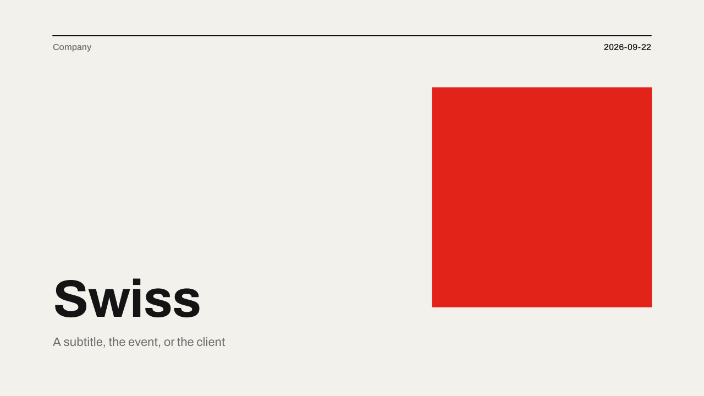
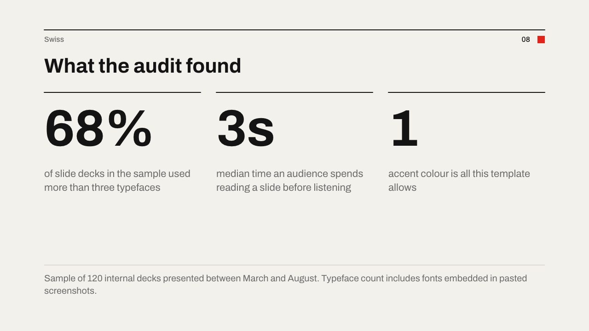
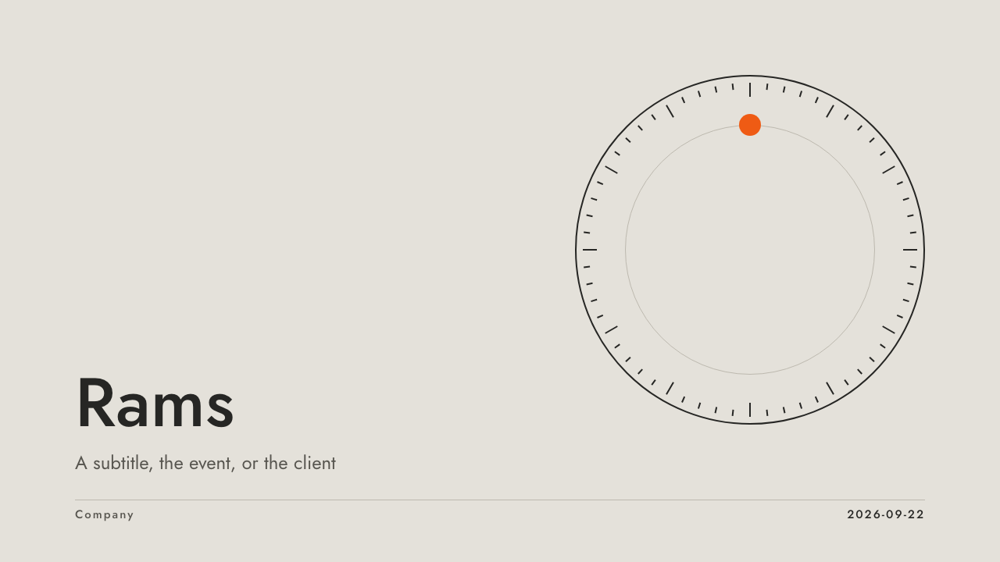
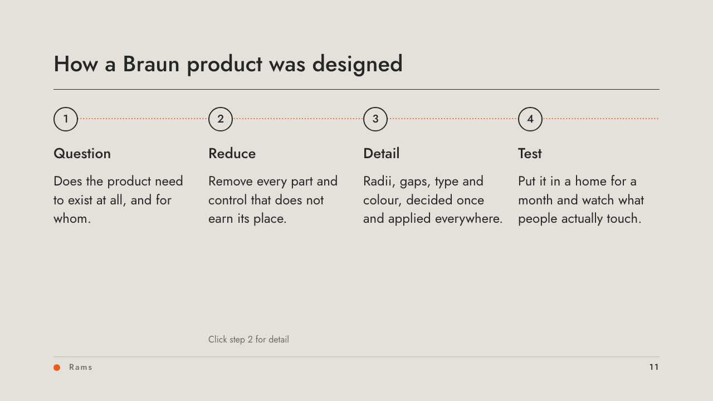
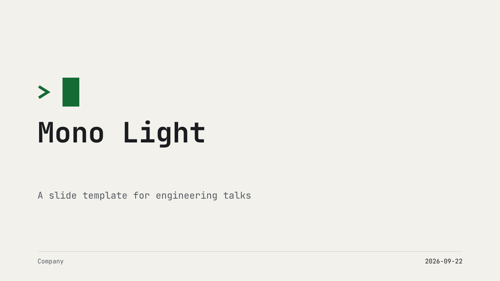
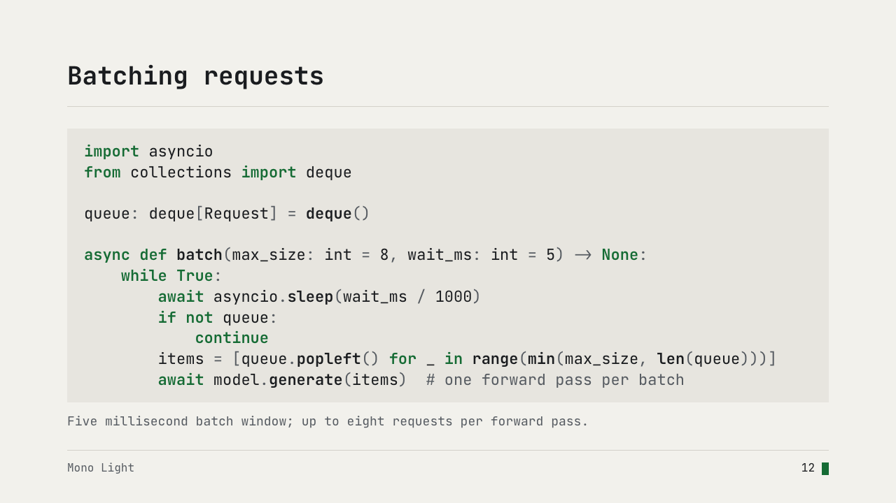
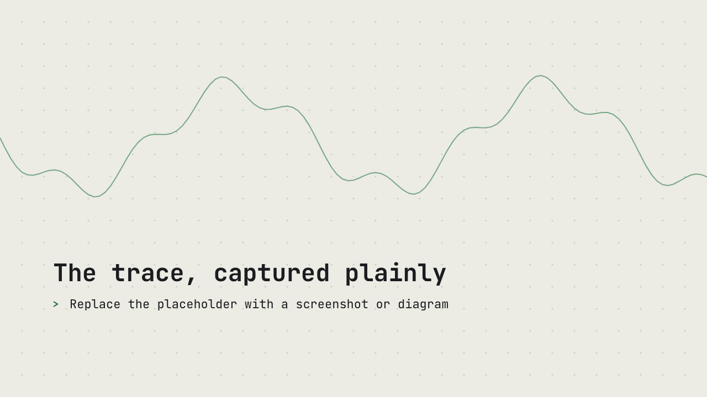
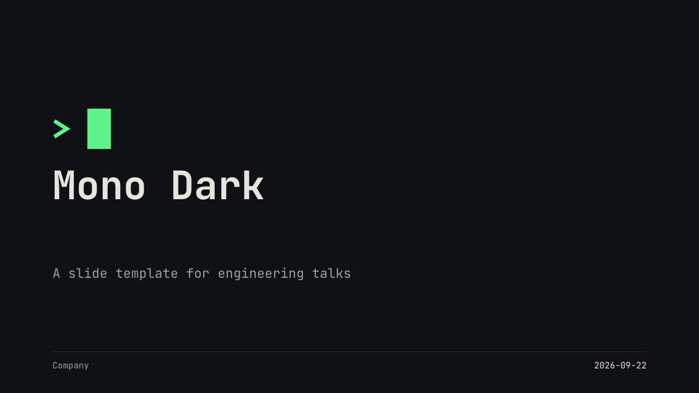
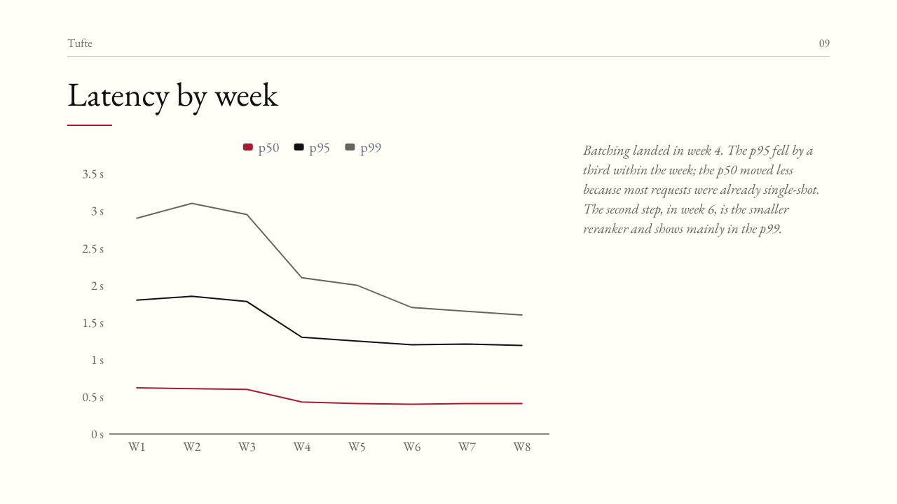
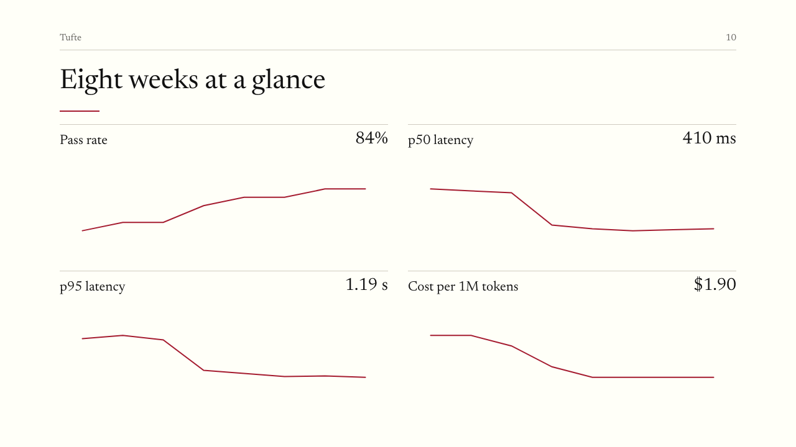

# Bento themes

Open source themes for [Bento](https://bento.page) slide decks. Each theme is a single `.bento.html` template: open it in a browser and it mints a fresh deck with the theme's colours, typeface, layouts and a demo deck showing every layout in use.

## Themes

### Swiss

International Typographic Style. One grotesque (Archivo), flush-left ragged-right type, a 2px rule and running head on every slide, warm-white paper and one red. A single red square recurs through the deck: a 400px block on the cover, a 16px square beside the page number, a bar on section dividers, full-bleed on the closing slide.




### Rams

Mid-century product design after Dieter Rams and Braun. Warm grey ground, charcoal text, hairlines, a geometric sans (Jost) and one orange indicator, the only colour on the page. The indicator sits on a dial on the cover and recurs through the deck as a footer dot, a disc on the black section dividers and a large disc at the end.




### Mono (light and dark)

A well-set terminal, for engineering talks. One monospace face (JetBrains Mono), a `>` prompt and a block cursor as the recurring mark: an idle prompt line above the cover title, in the status bar beside the page number, after the numeral on the inverted section dividers and as a large block on the closing slide. Adds a `code` layout for syntax-coloured snippets on a panel. Two palettes share every builder. Mono Light is warm paper with a deep green; use it by default, since light slides survive projectors, screen sharing and video compression better than dark ones. Mono Dark is near-black with phosphor green for a dim room. `themes/mono-light/theme.mjs` is the light palette applied to the builders in `themes/mono-dark/theme.mjs`.






### Tufte

Data slides after Edward Tufte's books, for talks where the charts and tables carry the argument. Cream page, EB Garamond at regular weight (the closest Google Fonts face to the Bembo of his books), a side-note column beside the main text, and hairline rules in place of boxes. Charts carry the least ink the runtime allows: no gridlines, thin axes, three series in brick red, ink and grey. The table is ruled only above and below the header and at the foot. A 15th layout puts four sparklines on a 2x2 grid. The one mark is a short red rule under every title.




## Using a theme

1. Download `themes/<name>/<Name>.bento.html` and open it in a browser. The file is a template, so every open starts a new deck.
2. Set the title, company and author under File > Properties. Covers and footers fill from them.
3. Add slides from the New-slide picker; the theme's layouts are listed under "This document".
4. Save. The saved deck is an ordinary Bento file and no longer a template.

To apply a theme to an existing deck, paste the layouts from `<Name>.doc.json` into your deck's JSON (Save > Replace from JSON) or point an agent at the theme file with the bento-slides skill.

Every theme has the same core layouts (cover, agenda, section, statement, title and body, points, two columns, numbers, chart, table, process with a clickable detail state, quote, full-bleed image, closing) plus three for screenshots: one large capture, a capture with notes beside it, and two clippings side by side. Captures are letterboxed (`fit: "contain"`) so mismatched aspect ratios still sit tidily; the placeholder is a wireframe drawn in code, replace it with a PNG downscaled to 2560px wide. Every layout carries speaker notes on its demo slide explaining what it is for. The templates are animation-free: no transitions, entrances, loops, step reveals or count-ups. Element ids are stable across slides, so setting `transition: "morph"` on a slide is all it takes to animate the shared chrome if you want it.

## Building

Themes are generated, not hand-written. `themes/<name>/theme.mjs` returns the full document; `scripts/build.mjs` checks it and splices it into the Bento runtime.

```
make runtime      # fetch the latest Bento release into runtime/ and record its version in runtime/VERSION
make build        # write themes/*/<Name>.doc.json and <Name>.bento.html
make check        # headless render: validate() findings + preview PNGs
```

The committed runtime is the version in `runtime/VERSION`. `make check` prints the version each deck booted with, so a re-fetch that changes rendering shows up in the log and the preview diff.

`make check` needs Node 22+ and a Chromium-based browser (Brave, Chrome or Chromium). It refuses to run inside a sandbox that blocks the browser profile directory.

## Adding a theme

1. Create `themes/<name>/theme.mjs` exporting a default function that returns a `bento/slides` document. Use `scripts/lib.mjs` for the element factories, column arithmetic and font embedding.
2. Give every slide `notes` and every element an `id`. Keep ids stable across slides so users can opt into morph transitions.
3. Set `template: true`, `present: { slideNumber: false }` if the theme draws its own page numbers, and embed fonts as woff2 data URIs under `assets`.
4. Run `make check` and read every PNG. Text overflow and dropped keys are invisible in the JSON.

For a colour variant, export a named builder that takes a palette and import it from a second directory (`themes/mono-light/theme.mjs` is 20 lines). Layout ids carry the variant slug so both sets can live in one deck. `make` treats any directory with a `theme.mjs` as a theme.

`assertDoc` enforces: no `fx`, `transition: "none"` on every slide and layout, the 14px type floor, unique ids, notes on every slide, valid link and state targets, placeholders for layout copy. Conventions the themes follow by hand: one accent colour, one or two typefaces, 96px side margins, body text 22px or larger.

### Gotchas

- Write every typographic field on every element. When the runtime expands a document it fills gaps with editor defaults (system font, centred, `#1E2A3A`), never with `theme` values. `factory()` in `scripts/lib.mjs` does this for you.
- `template: true` and `layouts` do not survive a round trip through `window.bento.loadDoc()` and `render_check.mjs --write`. Splice the JSON yourself (`build.mjs`) and use `render_check.mjs` only to validate and screenshot.
- Layout text the user replaces takes `html: ""` plus `placeholder`; chrome that must render (`{{title}}`, `{{page:2}}`) keeps `html`. Layouts must not carry `link`.
- A 1px `line` shape renders thicker than 1px; use a `rect` with `h: 1` for hairlines.
- Step reveals (`fx.step`) consume arrow presses. The vendored `render_check.mjs` presses through them before capturing each page; the upstream copy in the bento-slides skill does not and stops short of the last slides. Only relevant if a theme ever adds steps.
- Use a literal date on covers. `{{date}}` renders the day the deck is opened.
- Charts: `splitLine.show` and `axisLine.show` are ignored without a warning and the lines still draw. Paint them in the ground colour instead (`splitLine.lineStyle.color`). `legend` can only sit top or bottom centred; `legend.right` is reported as ignored.
- Tables have no per-edge borders. For rules on some row boundaries only, set `borderWidth: 0` and lay hairline rects over the boundaries (rows are uniform height, so `h / rows` gives the pitch). Header text is always bold.
- `code` elements take their colours from `theme.codePalette`; `themeName` is in the schema but the 1.2.3 renderer ignores it.

## Fonts

Archivo (35KB), Jost (26KB), JetBrains Mono (31KB) and EB Garamond (44KB upright, 47KB italic) are embedded as Latin-subset variable woff2 files under the SIL Open Font License; see `fonts/OFL-*.txt`. EB Garamond's italic is a second file declared with `style: "italic"` so side notes are true italics rather than browser-synthesised obliques. Bento's two shell faces (Fraunces 900 and Instrument Sans) need no bytes at all: `"asset": "builtin:fraunces-900"` or `"builtin:instrument-sans"`.

## Licence

Theme sources (`scripts/`, `themes/*/theme.mjs`, this README) are MIT. Each generated `.bento.html` also contains the Bento runtime (MIT, (c) The Bento authors, redistributed as released at bento.page) and the embedded fonts (SIL OFL 1.1, see `fonts/`).
